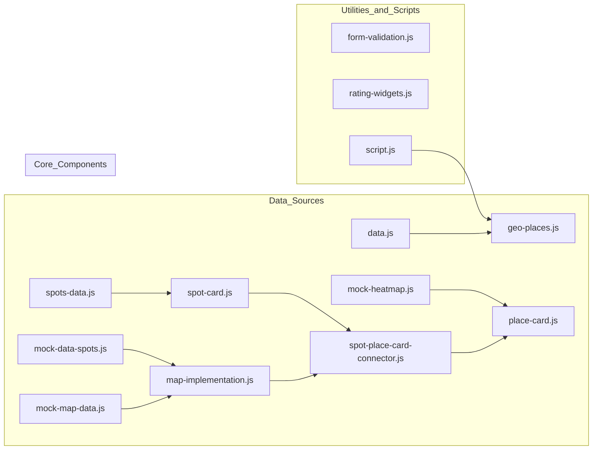
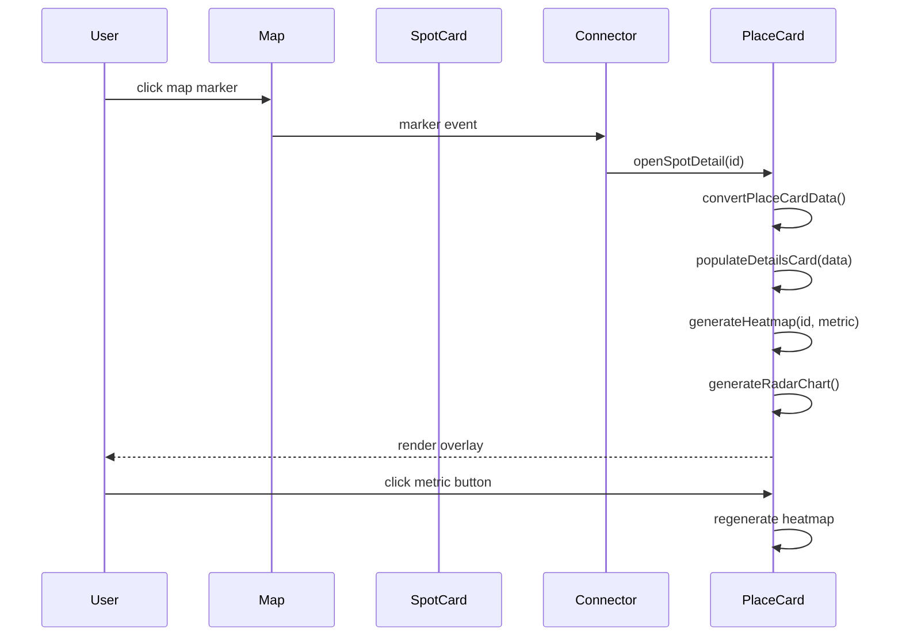
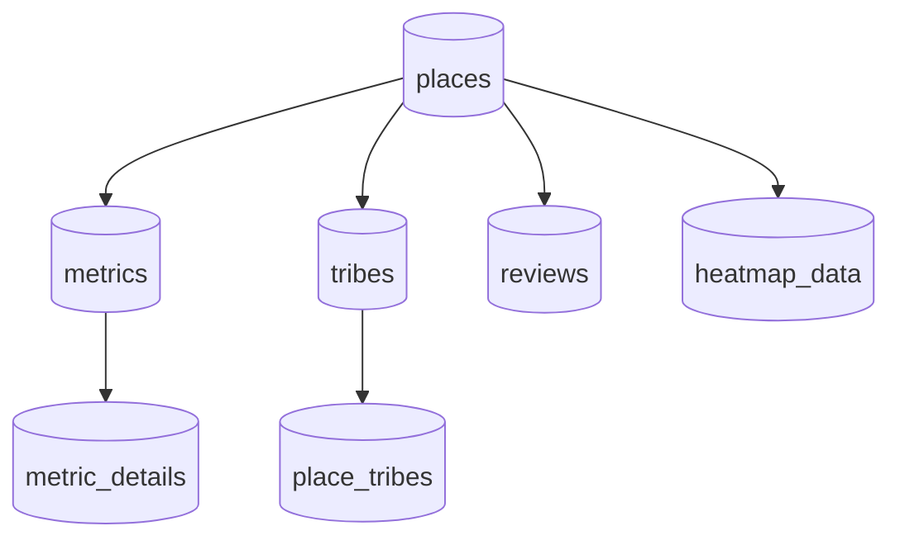

# Brews and Bytes Architecture & Data Flow

This document presents Mermaid diagrams illustrating the information and data flow across the Brews and Bytes project.

## 1. System Overview

## 2. User Interaction & Data Flow

## 3. Data Model Flow

