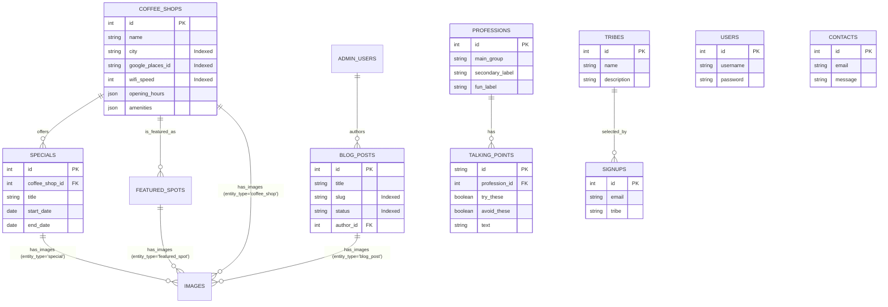
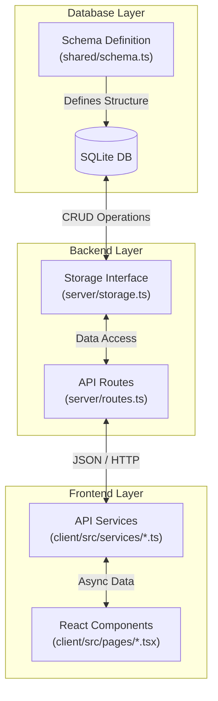

# Database Schema & Code Mapping

This document outlines the database schema for **Brews and Bytes**, its relationships, and how it maps to the application code (Backend API and Frontend Services).

## 1. Database Schema Overview

The database schema is defined using **Drizzle ORM** in [website/shared/schema.ts](file:///c:/Users/jdc/Documents/GithubPersonal/jdc.code.brewsandbytes/website/shared/schema.ts).
The application uses **SQLite** for development and is compatible with **PostgreSQL** for production (e.g., Neon).

### Entity-Relationship Diagram (ERD)

## 2. Data Flow Architecture

Data flows from the database through the storage layer, exposed via Express API routes, and consumed by React services.

## 3. Detailed Table-to-Code Mapping

### Core Tables

| Table Name | Drizzle Definition | API Routes | Frontend Service | Description |
|------------|-------------------|------------|------------------|-------------|
| **coffee_shops** | [schema.ts](file:///c:/Users/jdc/Documents/GithubPersonal/jdc.code.brewsandbytes/website/shared/schema.ts#L75) | `GET /api/coffee-shops` [routes.ts](file:///c:/Users/jdc/Documents/GithubPersonal/jdc.code.brewsandbytes/website/server/routes.ts#L24) | [coffeeShopApi.ts](file:///c:/Users/jdc/Documents/GithubPersonal/jdc.code.brewsandbytes/website/client/src/services/coffeeShopApi.ts#L1) | Stores main workspace data. Indexed on `city`, `wifi_speed`. |
| **specials** | [schema.ts](file:///c:/Users/jdc/Documents/GithubPersonal/jdc.code.brewsandbytes/website/shared/schema.ts#L247) | `GET /api/specials` [routes.ts](file:///c:/Users/jdc/Documents/GithubPersonal/jdc.code.brewsandbytes/website/server/routes.ts#L343) | [coffeeShopApi.ts](file:///c:/Users/jdc/Documents/GithubPersonal/jdc.code.brewsandbytes/website/client/src/services/coffeeShopApi.ts#L32) | Promotions linked to coffee shops. |
| **featured_spots** | [schema.ts](file:///c:/Users/jdc/Documents/GithubPersonal/jdc.code.brewsandbytes/website/shared/schema.ts#L289) | `GET /api/featured-spots` [routes.ts](file:///c:/Users/jdc/Documents/GithubPersonal/jdc.code.brewsandbytes/website/server/routes.ts#L359) | [coffeeShopApi.ts](file:///c:/Users/jdc/Documents/GithubPersonal/jdc.code.brewsandbytes/website/client/src/services/coffeeShopApi.ts#L55) | Monthly featured locations. |
| **blog_posts** | [schema.ts](file:///c:/Users/jdc/Documents/GithubPersonal/jdc.code.brewsandbytes/website/shared/schema.ts#L194) | `GET /api/blog-posts` [routes.ts](file:///c:/Users/jdc/Documents/GithubPersonal/jdc.code.brewsandbytes/website/server/routes.ts#L294) | [adminApi.ts](file:///c:/Users/jdc/Documents/GithubPersonal/jdc.code.brewsandbytes/website/client/src/services/adminApi.ts) | Content marketing posts. |
| **tribes** | [schema.ts](file:///c:/Users/jdc/Documents/GithubPersonal/jdc.code.brewsandbytes/website/shared/schema.ts#L347) | `GET /api/tribes` [routes.ts](file:///c:/Users/jdc/Documents/GithubPersonal/jdc.code.brewsandbytes/website/server/routes.ts#L391) | - | Community tribes (e.g., Creatives, Techies). |
| **professions** | [schema.ts](file:///c:/Users/jdc/Documents/GithubPersonal/jdc.code.brewsandbytes/website/shared/schema.ts#L362) | `GET /api/professions` [routes.ts](file:///c:/Users/jdc/Documents/GithubPersonal/jdc.code.brewsandbytes/website/server/routes.ts#L407) | - | List of 80+ remote work professions. |
| **talking_points** | [schema.ts](file:///c:/Users/jdc/Documents/GithubPersonal/jdc.code.brewsandbytes/website/shared/schema.ts#L379) | `GET /api/talking-points` [routes.ts](file:///c:/Users/jdc/Documents/GithubPersonal/jdc.code.brewsandbytes/website/server/routes.ts#L423) | - | Conversation starters for specific professions. |

### User Interaction Tables

| Table Name | Drizzle Definition | API Routes | Frontend Service | Update Strategy |
|------------|-------------------|------------|------------------|-----------------|
| **contacts** | [schema.ts](file:///c:/Users/jdc/Documents/GithubPersonal/jdc.code.brewsandbytes/website/shared/schema.ts#L21) | `POST /api/contact` `GET /api/contacts` | [adminApi.ts](file:///c:/Users/jdc/Documents/GithubPersonal/jdc.code.brewsandbytes/website/client/src/services/adminApi.ts) | Append-only via form. |
| **signups** | [schema.ts](file:///c:/Users/jdc/Documents/GithubPersonal/jdc.code.brewsandbytes/website/shared/schema.ts#L41) | `POST /api/signup` `GET /api/signups` | [adminApi.ts](file:///c:/Users/jdc/Documents/GithubPersonal/jdc.code.brewsandbytes/website/client/src/services/adminApi.ts) | Append-only via waitlist form. |
| **subscribers** | [schema.ts](file:///c:/Users/jdc/Documents/GithubPersonal/jdc.code.brewsandbytes/website/shared/schema.ts#L61) | `POST /api/subscribe` `GET /api/subscribers` | [adminApi.ts](file:///c:/Users/jdc/Documents/GithubPersonal/jdc.code.brewsandbytes/website/client/src/services/adminApi.ts) | Append-only. |

### Admin & System Tables

| Table Name | Drizzle Definition | API Routes | Description |
|------------|-------------------|------------|-------------|
| **admin_users** | [schema.ts](file:///c:/Users/jdc/Documents/GithubPersonal/jdc.code.brewsandbytes/website/shared/schema.ts#L134) | `/api/admin/*` | Back-office authentication. |
| **notifications** | [schema.ts](file:///c:/Users/jdc/Documents/GithubPersonal/jdc.code.brewsandbytes/website/shared/schema.ts#L214) | `/api/admin/notifications` | System alerts. |
| **images** | [schema.ts](file:///c:/Users/jdc/Documents/GithubPersonal/jdc.code.brewsandbytes/website/shared/schema.ts#L313) | `/api/upload` | Polymorphic image storage. |

## 4. Code Block Links

### Schema Definitions
- [User Schema](file:///c:/Users/jdc/Documents/GithubPersonal/jdc.code.brewsandbytes/website/shared/schema.ts#L5)
- [Coffee Shop Schema](file:///c:/Users/jdc/Documents/GithubPersonal/jdc.code.brewsandbytes/website/shared/schema.ts#L75)
- [Blog Post Schema](file:///c:/Users/jdc/Documents/GithubPersonal/jdc.code.brewsandbytes/website/shared/schema.ts#L194)

### Server Storage Implementation
- [MemStorage Class](file:///c:/Users/jdc/Documents/GithubPersonal/jdc.code.brewsandbytes/website/server/storage.ts#L96)
- [Coffee Shop Operations](file:///c:/Users/jdc/Documents/GithubPersonal/jdc.code.brewsandbytes/website/server/storage.ts#L237)

### API Routes
- [Coffee Shop Routes](file:///c:/Users/jdc/Documents/GithubPersonal/jdc.code.brewsandbytes/website/server/routes.ts#L22)
- [Blog Routes](file:///c:/Users/jdc/Documents/GithubPersonal/jdc.code.brewsandbytes/website/server/routes.ts#L294)
