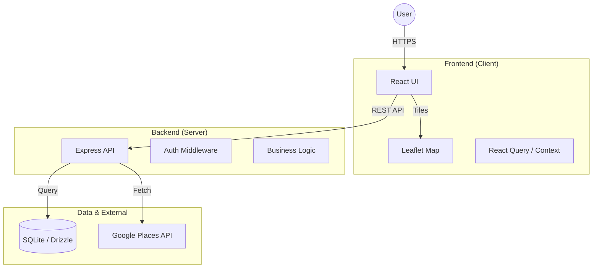

# Brews and Bytes ☕️💻

> **Insights by the crowd, for the crowd.**


**Brews and Bytes** is a social infrastructure platform dedicated to helping remote workers, freelancers, and digital nomads find the perfect workspace in Somerset West. We leverage **crowdsourced wisdom** to rate coffee shops not just on their coffee, but on what matters to *us*: WiFi speed, power outlet availability, noise levels, and community vibe.

---

## 📸 Snapshots

| Landing Page | Interactive Map |
|:---:|:---:|
|  |  |

| Tribe System | Merchandise |
|:---:|:---:|
|  |  |

---

## ✨ Features

- 🗺️ **Interactive Workspace Map**: Filter locations by WiFi speed, "vibe", and amenities.
- 📊 **Crowdsourced Metrics**: Real-time data on internet quality, noise levels, and seat availability.
- 👥 **Tribe System**: Find where your people hang out. Are you a *Code Conjurer* or a *Pixel Pixie*?
- 📝 **Detailed Reviews**: "Talking Points" to help you break the ice with fellow nomads.
- 🛍️ **Merch Store**: Grab some caffeine-fueled gear.
- 📱 **Mobile Responsive**: Works perfectly on your phone while you're on the go.

---

## 🏗 Architecture



---

## 🛠 Tech Stack

### Frontend
*   **Framework**: React 18 (Vite)
*   **Language**: TypeScript
*   **Styling**: Tailwind CSS, Framer Motion
*   **Maps**: Leaflet / React-Leaflet
*   **State**: TanStack Query

### Backend
*   **Runtime**: Node.js
*   **Framework**: Express.js
*   **Database**: SQLite (Dev) / PostgreSQL (Prod ready)
*   **ORM**: Drizzle ORM
*   **Validation**: Zod

### Tools
*   **Scripts**: Bash / Python automation
*   **Process Manager**: PM2

---

## 🚀 Getting Started

### Prerequisites
*   Node.js (v18 or higher)
*   npm or yarn
*   Python 3.12+ (for data processing scripts)

### Installation

1.  **Clone the repository**
    ```bash
    git clone https://github.com/yourusername/brewsandbytes.git
    cd brewsandbytes
    ```

2.  **Install dependencies**
    ```bash
    cd website
    npm install
    ```

3.  **Environment Setup**
    Create a `.env` file in the `website` directory based on `.env.example`.

4.  **Run Development Server**
    ```bash
    npm run dev
    ```
    Visit `http://localhost:5000` (or the port shown in terminal).

### Production Build
To build and serve the production version:
```bash
npm run build
npm start
```

---

## 📂 Project Structure

```
brewsandbytes/
├── 📂 docs/            # Documentation & Presentations
├── 📂 screenshots/     # Project screenshots
├── 📂 scripts/         # Automation & Deployment scripts
├── 📂 website/         # Main Application
│   ├── 📂 client/      # React Frontend
│   ├── 📂 server/      # Express Backend
│   ├── 📂 shared/      # Shared Types/Schemas
│   └── ...
└── 📂 database/        # DB schemas and mock data
```

---

## 🤝 Contributing

We love contributions! Whether you're a *Code Conjurer* fixing bugs or a *Word Weaver* improving documentation, you're welcome here.

1.  Fork the repo
2.  Create your feature branch (`git checkout -b feature/AmazingFeature`)
3.  Commit your changes (`git commit -m 'Add some AmazingFeature'`)
4.  Push to the branch (`git push origin feature/AmazingFeature`)
5.  Open a Pull Request

---

## 📄 License

Distributed under the MIT License. See `LICENSE` for more information.

---

*Built with ☕️ and 💻 in Somerset West.*
